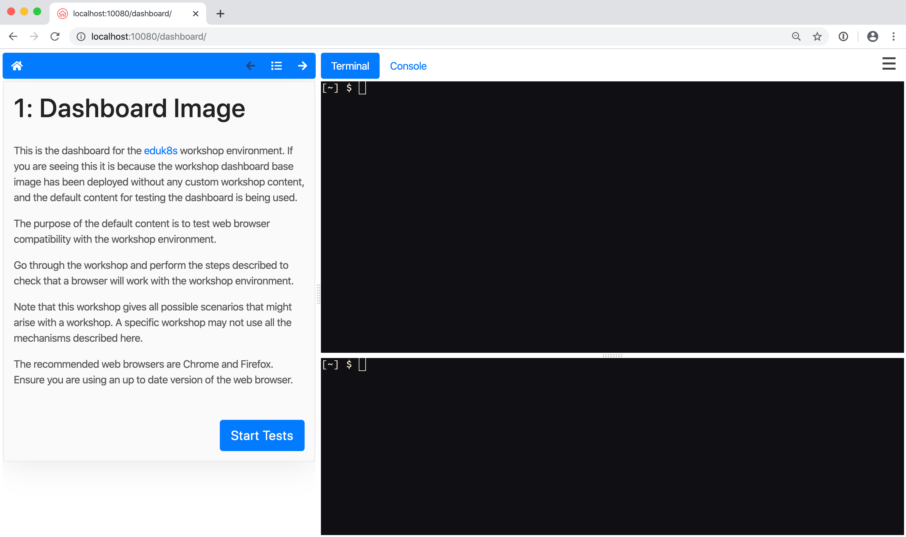
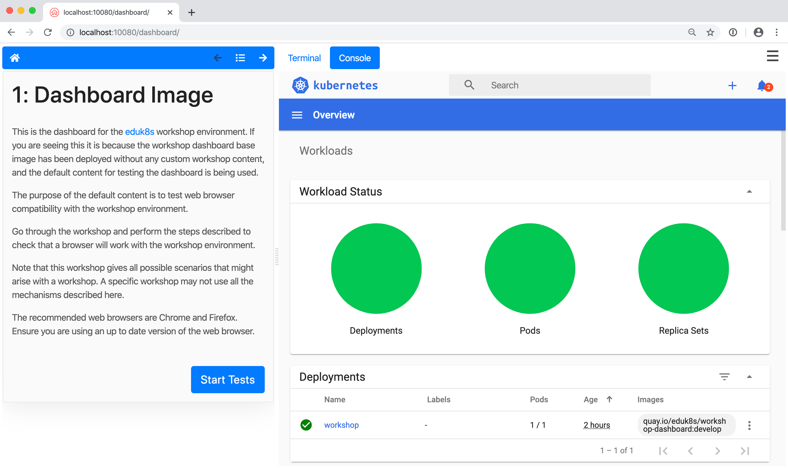

Workshop Dashboard
==================

This repository contains software for deploying a containerised workshop environment in Kubernetes. It is intended to be used in self paced or supervised workshops where users need access to command line clients and other tools when working with Kubernetes, and you want to avoid needing to have users install anything on their own local computer.

Users are provided access to a dashboard combining workshop content and a shell environment via a terminal in their web browser.



The dashboard can embed access to the Kubernetes web console for the cluster being used.



The dashboard image provides the following command line clients, tools and software stacks:

* Editors: ``vi``, ``nano``
* Kubernetes clients: ``kubectl``
* OpenShift clients: ``oc``
* Language runtimes: ``node.js``, ``python``

For the language runtimes, commonly used packaging tools for working with that language are also included.

Quick start instructions
------------------------

To quickly see what the workshop environment looks like, create a new namespace in your Kubernetes cluster called `eduk8s`:

```
kubectl create ns eduk8s
```

and then run:

```
kubectl apply -k https://github.com/eduk8s/workshop-dashboard -n eduk8s
```

This will deploy an instance of the user environment as a standalone deployment. The name of the deployment will be ``workshop``.

To access the workshop environment, run:

```
kubectl port-forward svc/workshop 10080:10080 -n eduk8s
```

From your web browser then access:

```
http://localhost:10080
```

Note that the test deployment is not by default password protected. Do not expose it outside of your own system.

To delete the test deployment when done, run:

```
kubectl delete -k https://github.com/eduk8s/workshop-dashboard -n eduk8s
```
