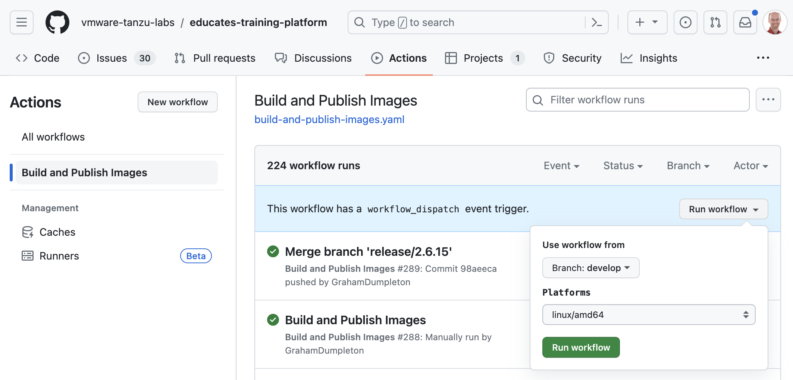

Release Procedures
==================

All changes pertaining to a new release should be worked on in forks of the main Educates GitHub repository, with changes submited via pull requests back to the `develop` branch of the main repository. When it is time for a release, the following steps should be followed.

Updates to the Documentation
----------------------------

Before any release is performed, documentation should first be updated for any changes being made in the release. Documentation updates should consist of:

* Additions or updates to core documentation related to any new features or changes.
* Addition of release notes for the release. This should be added to the [project-docs/release-notes](../project-docs/release-notes) directory.
* Link the release notes into the documentation table of contents. This should be added to [project-docs/index.rst](../project-docs/index.rst).
* Update the notice for the current released version of Educates. This should be added to [project-docs/project-details/project-overview.md](../project-docs/project-details/project-overview.md).

Where changes are non trivial or need further explanation, the release notes should include a cross reference to other parts of the documentation describing the feature.

Triggering a Development Build
------------------------------

For any individual code changes the developer of the changes should have already built and tested the changes on their local system. If a complete build of Educates consisting of all code changes for a release is required, a build from the `develop` branch can be triggered using a GitHub actions workflow dispatch trigger event. This can be done from the GitHub actions page of the main Educates GitHub repository located at:

* [https://github.com/vmware-tanzu-labs/educates-training-platform/actions](https://github.com/vmware-tanzu-labs/educates-training-platform/actions)

If necessary this could also be done from a developers fork of the Educates GitHub repository.



From the GitHub actions page select "Build and Publish Images" from the list of workflows, then click on the "Run workshop" dropdown. In the drop down select the branch `develop` and then the list of platforms to run the build.

By default the build will only be run for the `linux/amd64` platform. The `linux/arm64` platform can instead be selected, or both, by selecting `linux/amd64,linux/arm64`. Note that any `linux/arm64` build will take significantly longer as the build is done under GitHub actions using the QEMU machine emulator and virtualizer.

Being a development build, all the containers images, client programs and package bundles will be created, but a GitHub release will not be done. To test the release, clients programs and package resource manifests for installing the development version can be downloaded from the build artifacts of the GitHub actions workflow run. Client programs can also be download by using the command:

```
imgpkg pull -i ghcr.io/vmware-tanzu-labs/educates-client-programs:develop -o /tmp/client-programs
```
